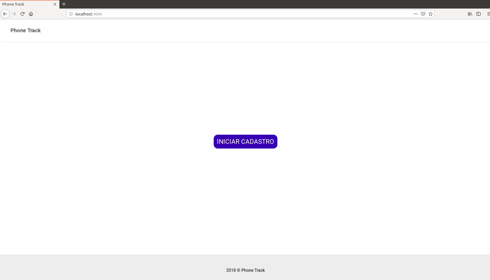

# Phone Track
### Avaliação Vaga Programador - Backend

## Sobre

Este projeto foi feito em PHP e não utiliza nenhum Framework PHP popular (Laravel ou Symfony).

Este projeto utiliza a arquitetural MVC (Model-View-Controller).

#### Estrutura de diretorios
    
* app
    * Controller
        * [IndexController.php](app/Controller/IndexController.php)
    * Model
        * [Cliente.php](app/Model/Cliente.php)
    * Src
        * DataBase
            * [Model.php](app/Src/DataBase/Model.php)
            * [Repository.php](app/Src/DataBase/Repository.php)
        * Http
            * HttpRequest
                * [Request.php](app/Src/Http/HttpRequest/Request.php)
            * [Router.php](app/Src/Http/Router.php)
        * [Application.php](app/Src/Application.php)
    * View
        * layouts
            * [footer.phtml](app/View/layouts/footer.phtml)
            * [header.phtml](app/View/layouts/header.phtml)
        * [index.phtml](app/View/index.phtml)
* helper
    * [database.php](helper/database.php)
    * [functions.php](helper/functions.php)
* public
    * assets -> **Arquivos CSS e JavaScript**
* router
    * [web.php](router/web.php) -> **Rotas da Aplicação**
* vendor -> **Autoload e Pacotes de terceiros**
    
## Requisitos

* php ^7.1
* git
* composer

## Como baixa e instalar

Use o seguinte comando no Terminal (Linux ou MacOS) ou CMD (Windows), para poder baixar o projeto.

```txt
git clone https://github.com/jacsonsantos/phonetrack.git
```

Entre no diretorio do projeto de você acabou de baixar.

```txt
cd phonetrack
```

Agora vamos instalar nossa aplicacão

```txt
php composer.phar install
```

Para que nossa aplicação funcione perfeitamente precisaremos fazer uma pequena configuração em nosso arquivo **config.json**.

Renomei ou Copie o arquivo **[config.example.json](config.example.json)** para apenas **config.json**.

```txt
cp config.example.json config.json
```

### Sobre o Config.json

Este arquivo contém toda a informação necessaria para que nossa aplicação funcione.

| nome | descrião |
|------|--------|  
|app_name|Nome da Aplicação|
|versao|Versão da Aplicação|
|url_base| URL base da Aplicação|
|debug| Habilita o Debug da Aplicação|
|database| Informações do seu Banco de dados|

O arquivo **config.json** já vem pré configurado, informe apenas as informações de seu Banco de dados.

```json
{
    "app_name":"Phone Track",
    "versao":"v1",
    "url_base":"http://127.0.0.1:4040/",
    "debug": true,
    "database": {
        "driver":"mysql",
        "host":"127.0.0.1",
        "dbname":"phonetrack",
        "username":"meuUsuario",
        "password":"minhaSenha"
    }
}
```

## Banco de Dados

Execute o script SQL [dump.sql](dump.sql) para criar o banco da aplicação e suas tabelas.

## Iniciando Aplicação

Se você fez todos os passos anteriores corretamente, já podemos inciar nossa aplicação.
Para iniciar a aplicação execute o seguinte comando.

```txt
php -S localhost:4040 -t public
```

Acesse o seguinte endereço: [http://localhost:4040](http://localhost:4040)

## Tela Inicial

